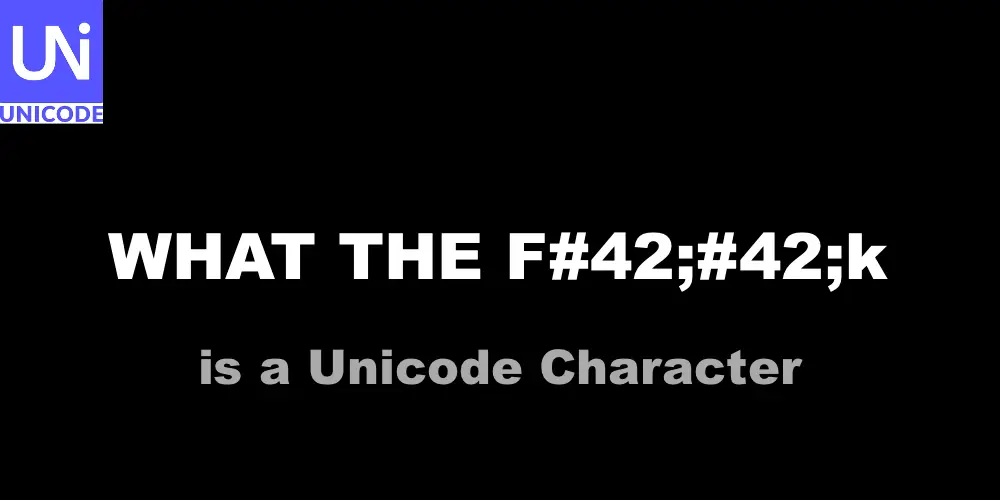

# HTML Unicode Escaped Characters

HTML escaped characters are special sequences of characters used in HTML to represent characters that cannot be easily typed using a keyboard or that have a special meaning in HTML. These characters are also known as HTML entities or character entities.

HTML escaped characters are created by using an ampersand (&) followed by a specific code or name that represents the character, and then closing the sequence with a semicolon (;). For example, the escaped character for the less than sign (<) is `&lt;` and for the greater than sign (>) it is `&gt;`.

Here are some common HTML escaped characters and their codes:

- &lt; represents the less than sign (<)
- &gt; represents the greater than sign (>)
- &amp; represents the ampersand (&)
- &#34; represents the double quote (")
- &#39; represents the single quote (')

## When to Use HTML Escaped Characters

Special Characters: HTML escaped characters are used to represent special characters that have a specific meaning in HTML, such as the less than sign (<), greater than sign (>), and ampersand (&).

### Non-ASCII Characters

HTML escaped characters are also used to represent non-ASCII characters, such as accented letters, that cannot be easily typed on a keyboard.

### Reserved Characters

Some characters are reserved in HTML and cannot be used in certain contexts, such as the forward slash (/) in URLs. In these cases, HTML escaped characters can be used to represent the reserved character.

### Encoding Errors

If the text on a webpage is not encoded properly, it can result in encoding errors. HTML escaped characters can be used to represent the incorrectly encoded characters and ensure that they are displayed correctly on the webpage.

## Why HTML Escaped Characters Exist

HTML escaped characters exist to solve a problem with the way HTML interprets characters. HTML uses certain characters, such as the less than sign (<) and greater than sign (>), to denote the start and end of HTML tags. If these characters appear in the text of a webpage, HTML can interpret them as tags and break the structure of the page. For example, if the text "5 < 10" was not properly escaped, HTML could interpret it as "5 " followed by a tag that does not exist, resulting in an error.

HTML escaped characters provide a way to include these characters in the text of a webpage without disrupting the structure of the page. By using an HTML escaped character, the special meaning of the character is ignored and it is treated as plain text.

In summary, HTML escaped characters are used to represent special characters, non-ASCII characters, reserved characters, and encoding errors in HTML. They exist to solve a problem with the way HTML interprets characters and to ensure that text is displayed correctly on a webpage.
