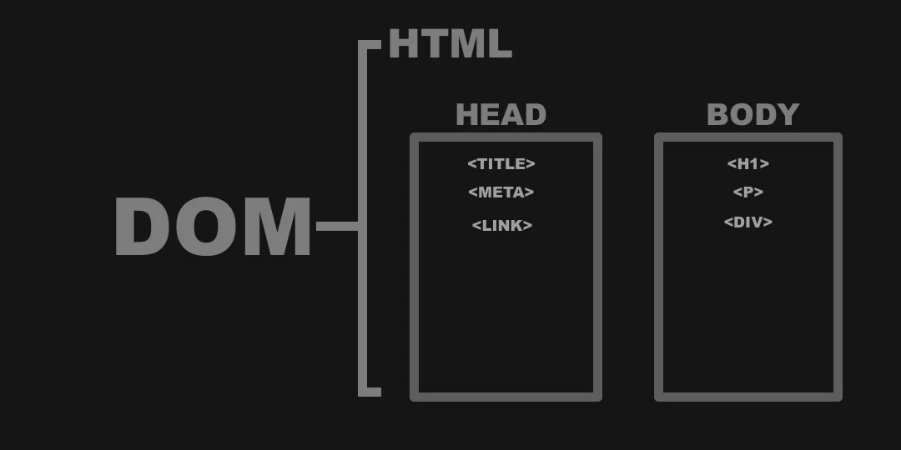

# What is HTML DOM?

The HTML Document Object Model (DOM) is an integral part of web development and is used to create dynamic web pages. It is a hierarchical tree-like structure that contains the content of the webpage, making it possible for developers to access and manipulate the content. Each element of the webpage is a node, with a unique ID and a set of attributes. The root node of the DOM tree is the HTML element, and all other elements of the webpage are descendants of the HTML element.

The DOM tree is divided into two parts, the document tree and the element tree. The document tree contains the main elements such as the `head` and `body`, while the element tree contains the properties and children of the element. In addition, the DOM contains a set of methods to access and manipulate elements, such as the getElementById() method which can be used to access an element by its ID. It is important to understand the structure and functions of the DOM in order to create a successful website.

## Interaction

JavaScript is primarily used to interact with the DOM. It provides a variety of methods for accessing and manipulating elements within the DOM, such as the `getElementById()` method which can be used to access an element by its ID, and the `setAttribute()` method which can be used to set the value of an element's attributes. Additionally, the `insertBefore()` method can be employed to insert a new element in the DOM before an existing element. These methods can be used to create interactive, engaging web pages with dynamic content that is constantly changing and updating.

## Events

HTML elements can be interacted with using events. An event is an action that is triggered when a user interacts with the element, such as clicking on a button or hovering over an image. When an event is triggered, it can invoke a function that will execute a certain set of instructions. For example, when a user clicks on a button, an event listener can be used to execute a function to perform some action such as opening a new page or submitting a form.

### Common Events

- `click`
  - Detects a full mouse click
- `mousedown`
  - Fires when a user clicks a mouse down
- `mouseup`
  - Fires when a user releases a mouse click
- `keypress`
  - Detects a full keypress
- `keydown`
  - Fires when a key is press down
- `keyup`
  - Fires when a key is released
